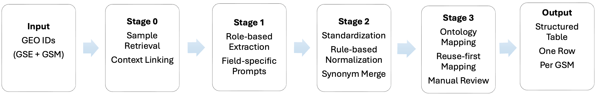

# GEOMeta


LLM-guided metadata extraction, semantic normalization, and ontology-aware metadata standardization framework for GEO transcriptomic studies.

---

# Overview

GEO metadata are highly heterogeneous across studies due to inconsistent free-text annotations, incomplete sample descriptions, variable disease terminology, fragmented tissue naming conventions, and inconsistent experimental metadata reporting.

GEOMeta addresses these challenges through a multi-stage metadata harmonization framework that combines:

- Context-aware metadata extraction
- Semantic normalization
- Ontology-aware disease and tissue mapping
- Controlled perturbation standardization
- Reviewer-aware recovery and validation workflows

The framework is designed for large-scale cross-study transcriptomic integration and downstream biomedical machine learning applications.

The current curated release comprises 594,989 GSM samples derived from 22,782 unique GSE studies spanning diverse disease, tissue, demographic, and perturbation contexts.

---

# Pipeline Overview

GEOMeta multi-stage metadata harmonization workflow for GEO transcriptomic studies.

<p align="center">
  
</p>

---

# Installation

## Clone Repository

First, move to the local folder where you want to download GEOMeta:

```bash
cd /path/to/your/workspace
```

Then clone the repository:

```bash
git clone https://github.com/Bin-Chen-Lab/GEOMeta.git
cd GEOMeta
```

The git clone command creates a local folder named GEOMeta in the selected workspace. The cd GEOMeta command enters the GEOMeta project folder.

---

# GEOMeta Environment and LLM Setup

This guide describes the recommended one-time environment setup and LLM configuration for running the GEOMeta pipeline.

GEOMeta uses a provider-agnostic LLM interface based on OpenAI-compatible chat-completion endpoints. The recommended default backend is the direct OpenAI API with GPT-5.

---

## 1. Remove inherited library-path overrides

Some local Anaconda installations may inherit library-path variables from the base environment. These variables can cause Python packages in a new conda environment to load incompatible libraries from the base installation.

Before creating the GEOMeta environment, unset these variables:

```bash
unset DYLD_LIBRARY_PATH
unset DYLD_FALLBACK_LIBRARY_PATH
unset LD_LIBRARY_PATH
```

Confirm they are empty:

```bash
echo "DYLD_LIBRARY_PATH=$DYLD_LIBRARY_PATH"
echo "DYLD_FALLBACK_LIBRARY_PATH=$DYLD_FALLBACK_LIBRARY_PATH"
echo "LD_LIBRARY_PATH=$LD_LIBRARY_PATH"
```

Expected output should be empty after the equals signs.

---

## 2. Create a clean conda environment

Create a new conda environment using conda-forge only:

```bash
conda create -n geometa -c conda-forge --override-channels \
  python=3.11 \
  numpy \
  pandas \
  openpyxl \
  scikit-learn \
  requests \
  fastparquet \
  python-docx \
  rapidfuzz \
  openai \
  expat \
  libexpat \
  -y
```

Activate the environment:

```bash
conda activate geometa
```

Confirm that Python is coming from the new environment:

```bash
which python
python -c "import sys; print(sys.executable)"
```

The printed path should include:

```text
envs/geometa/bin/python
```

---

## 3. Verify the environment

Before running GEOMeta, verify that the Python XML parser works. This is important because GEOMeta reads and writes Excel files through `openpyxl`, and Excel `.xlsx` files depend on XML support.

```bash
python - <<'PY'
import xml.parsers.expat
import xml.etree.ElementTree as ET

ET.fromstring("<root><x>ok</x></root>")
print("XML parser OK")
PY
```

Then verify the main GEOMeta dependencies:

```bash
python - <<'PY'
import pandas as pd
import sklearn
import fastparquet
import openai
import openpyxl
import docx
import rapidfuzz

print("pandas:", pd.__version__)
print("sklearn:", sklearn.__version__)
print("fastparquet OK")
print("openai:", openai.__version__)
print("openpyxl:", openpyxl.__version__)
print("python-docx OK")
print("rapidfuzz OK")
PY
```

If both tests pass, the environment is ready.

---

## 4. Direct OpenAI API with GPT-5

GEOMeta uses GPT-5 as the recommended default model for metadata annotation, post-processing, and mapping.

Set the following environment variables:

```bash
export LLM_API_TYPE=openai_compatible
export LLM_BASE_URL=https://api.openai.com/v1
export LLM_API_KEY="your_openai_api_key"
export LLM_MODEL=gpt-5
```

Do not save API keys directly in the codebase or commit them to GitHub.

---

## 5. Other OpenAI-compatible endpoints

GEOMeta can also connect to other OpenAI-compatible endpoints by changing the base URL, API key, and model name.

### LiteLLM proxy

```bash
export LLM_API_TYPE=openai_compatible
export LLM_BASE_URL=http://localhost:4000/v1
export LLM_API_KEY="your_litellm_key"
export LLM_MODEL=gpt-5
```

### OpenRouter

```bash
export LLM_API_TYPE=openai_compatible
export LLM_BASE_URL=https://openrouter.ai/api/v1
export LLM_API_KEY="your_openrouter_key"
export LLM_MODEL="openai/gpt-5"
```

### Local vLLM server

```bash
export LLM_API_TYPE=openai_compatible
export LLM_BASE_URL=http://localhost:8000/v1
export LLM_API_KEY=dummy
export LLM_MODEL="local-model-name"
```

### Local Ollama or LM Studio OpenAI-compatible endpoint

```bash
export LLM_API_TYPE=openai_compatible
export LLM_BASE_URL=http://localhost:11434/v1
export LLM_API_KEY=dummy
export LLM_MODEL="llama3.1"
```

Other models can be used, but annotation quality should be evaluated before production-scale use.

---

## 6. Run GEOMeta

Run the following commands from the GEOMeta project folder. Replace `/path/to/GEOMeta` with the location where you cloned or downloaded this repository on your own computer.

```bash
cd "/path/to/GEOMeta"
```

Check that you are in the correct folder:

```bash
ls
```
You should see folders such as `scripts`, `geo_annotation_agent`, `Annotation_Prompts`, `postprocessing`, `inference`, `input`, and `mappings`.

The repository includes an example GSE input file in the `input/` folder:

```text
input/gse_ids.csv
```

This file should contain a column named `GSE_ID`, for example:

```text
GSE_ID
GSE147493
GSE116860
```

Users can replace this file with their own GSE list, while keeping the same column name.

Run the full pipeline:

```bash
PYTHONPATH=. python scripts/run_pipeline.py \
  --workdir . \
  --gse-file input/gse_ids.csv
```

The `--workdir .` argument tells GEOMeta to use the current folder as the project working directory.

The input file can also be Excel, TSV, or TXT if supported by the runner script. CSV is recommended because it is simple and avoids Excel parser issues during input loading.


---

## 7. Run individual stages

If a previous stage has already completed, downstream stages can be run directly.

### Stage 2 from saved Stage 1 output

```bash
PYTHONPATH=. python scripts/run_stage2.py \
  --workdir . \
  --stage1 artifacts/outputs/<run_version>_stage1_raw.xlsx \
  --run-version <run_version>
```

### Stage 3 from saved Stage 2 output

```bash
PYTHONPATH=. python scripts/run_stage3.py \
  --workdir . \
  --stage2 artifacts/outputs/<run_version>_stage2_post_final.xlsx \
  --run-version <run_version>
```

Replace `<run_version>` with the actual run version printed by the pipeline.

---

## 8. Troubleshooting

### Error: `No module named expat` or `Symbol not found ... libexpat`

This indicates that Python is loading an incompatible XML library from outside the active conda environment.

First check whether library-path variables are set:

```bash
echo "DYLD_LIBRARY_PATH=$DYLD_LIBRARY_PATH"
echo "DYLD_FALLBACK_LIBRARY_PATH=$DYLD_FALLBACK_LIBRARY_PATH"
echo "LD_LIBRARY_PATH=$LD_LIBRARY_PATH"
```

If any of these contain a path such as `/Library/anaconda3/lib`, unset them:

```bash
unset DYLD_LIBRARY_PATH
unset DYLD_FALLBACK_LIBRARY_PATH
unset LD_LIBRARY_PATH
```

Then create the GEOMeta environment again using the setup commands above.

### Error: `ModuleNotFoundError: No module named 'openai'`

Install `openai` through conda-forge inside the active environment:

```bash
conda activate geometa
conda install -c conda-forge openai -y
```

Then test:

```bash
python - <<'PY'
import openai
print("openai:", openai.__version__)
PY
```

### Error: `Unable to find a usable engine; tried using: 'pyarrow', 'fastparquet'`

This means pandas cannot write Parquet files. Install `fastparquet`:

```bash
conda install -c conda-forge fastparquet -y
```

### Error: shell shows `>` after a multi-line command

This usually means the last line ended with a backslash. In shell commands, the final line should not end with `\`.

Correct:

```bash
PYTHONPATH=. python scripts/run_pipeline.py \
  --workdir . \
  --gse-file input/gse_ids.csv
```

Incorrect:

```bash
PYTHONPATH=. python scripts/run_pipeline.py \
  --workdir . \
  --gse-file input/gse_ids.csv \
```

### Error: `cd: too many arguments`

This happens when the path contains spaces. Wrap the path in quotes:

```bash
cd "/path/to/GEOMeta"
```

### Error: `GSE input file not found`

This means the file provided to `--gse-file` does not exist at the expected path.

Check that the file exists:

```bash
ls -lh input/gse_ids.csv
```

If needed, create a small CSV test file:

```bash
mkdir -p input

cat > input/gse_ids.csv <<'EOF'
GSE_ID
GSE147493
GSE116860
EOF
```

Then rerun the pipeline.


---

## 9. Repository Structure

```text
scripts/                Pipeline execution scripts
geo_annotation_agent/   Core pipeline implementation
Annotation_Prompts/     LLM extraction prompts
postprocessing/         Stage 2 normalization prompts
inference/              Derived metadata inference rules
mappings/               Disease/tissue/compound references
input/                  Input GSE accession lists
figures/                Workflow figures and diagrams
artifacts/              Outputs, caches, ledgers, and review files
```

---

## 10. Pipeline Stages

### Stage 0 — GEO Retrieval

Retrieves GEO metadata directly from NCBI GEO and constructs annotation-ready study/sample metadata blocks.

### Key Features

- Local GEO cache system
- Automatic retry/recovery
- Chunked GSM batching
- Structured GSE/GSM metadata generation

Implemented in:

```text
geo_annotation_agent/stage0_retrieve.py
```

---

### Stage 1 — LLM Metadata Annotation

Performs structured metadata extraction using role-specific prompts.

### Representative Extracted Metadata Fields

- Disease
- Tissue
- Experimental setting
- Perturbation, dose, frequency, duration
- RNA library
- Age
- Sex
- Ethnicity
- Specimen type
- Timepoint
- Outcome
- Organism
- Genotype
- Strain

### Key Features

- Role-based extraction
- Structured JSON enforcement
- Multi-GSM chunk annotation
- Recovery logic for malformed outputs
- Reviewer-aware logging system

Implemented in:

```text
geo_annotation_agent/stage1_annotate.py
```

---

### Stage 2 — Post-processing & Standardization

Applies controlled normalization and semantic standardization to Stage 1 outputs.

### Standardization Tasks

- Disease normalization
- Tissue normalization
- Experimental setting cleanup
- RNA source normalization
- Sex inference
- Age-group derivation
- Perturbation classification

### Key Features

- Field-specific post-processing prompts
- Cached normalization mappings
- Deterministic preprocessing
- Controlled vocabulary harmonization
- Selective rerun/review system

Implemented in:

```text
geo_annotation_agent/stage2_postprocess.py
```

---

### Stage 3 — Ontology-aware Mapping

Maps standardized metadata to curated biomedical ontologies and external resources.

### Disease Mapping

Disease annotations are mapped to:

- CTD MEDIC disease ontology
- MeSH-compatible disease identifiers
- Disease hierarchy metadata

### Tissue Mapping

Tissue annotations are normalized into curated tissue categories.

### Compound Mapping

Chemical perturbations are mapped to:

- PubChem compounds
- CID identifiers
- Canonical SMILES
- PubChem URLs

### Key Features

- Prior curated mapping reuse
- LLM-assisted ontology matching
- TF-IDF candidate retrieval
- Synonym-aware matching
- PubChem integration
- Novel-term detection
- Review/correction workflows

Implemented in:

```text
geo_annotation_agent/stage3_map.py
```

---

# Example Final Metadata Fields

- Disease
- Broad_Disease_Category
- Tissue
- RNA_Library
- Experimental_Setting
- GSE_Pert
- GSM_Pert
- Perturbation
- Pert_Type
- Age
- Age_Group
- Sex

---

# Output Files

Main outputs are written to:

```text
artifacts/outputs/
```

| File | Description |
|---|---|
| `*_stage0_input.parquet` | GEO retrieval output |
| `*_stage1_raw.xlsx` | Raw LLM annotations |
| `*_stage2_post.xlsx` | Standardized annotations |
| `*_stage3_mapped.xlsx` | Full ontology-mapped dataset |
| `*_stage3_mapped_filtered.xlsx` | Filtered mapped dataset |
| `*_stage3_final_release.xlsx` | Simplified final release dataset |
| `*_stage3_cp_perturbation_release.xlsx` | Compound perturbation-focused release dataset |

Additional artifacts include:

- Mapping caches
- GEO caches
- Review ledgers
- Novel term reports
- Manual review files

---

# Current Ontology Resources

## Disease

- CTD MEDIC
- MeSH-compatible disease hierarchy

## Compounds

- PubChem

## Tissue

- Curated tissue vocabulary
- Brain-region normalization framework

---

# Caching and Reproducibility

GEOMeta maintains persistent caches for:

- GEO downloads
- LLM normalization mappings
- Ontology mapping results

All intermediate outputs, caches, mappings, and review artifacts are retained to support reproducibility and iterative refinement.

---

# Notes

- GEO metadata quality varies substantially across studies.
- Some annotations may still require manual review.
- LLM outputs are constrained through structured prompting and reviewer-aware recovery logic.
- Large-scale runs may require substantial LLM API quota depending on dataset size and model selection.

---

# Citation

If you use GEOMeta in your work, please cite:

```text
Citation information will be added after manuscript publication.
```

---

# License

MIT License

---

# Acknowledgments

- NCBI GEO
- CTD MEDIC
- PubChem
- Human Protein Atlas
- OpenAI
