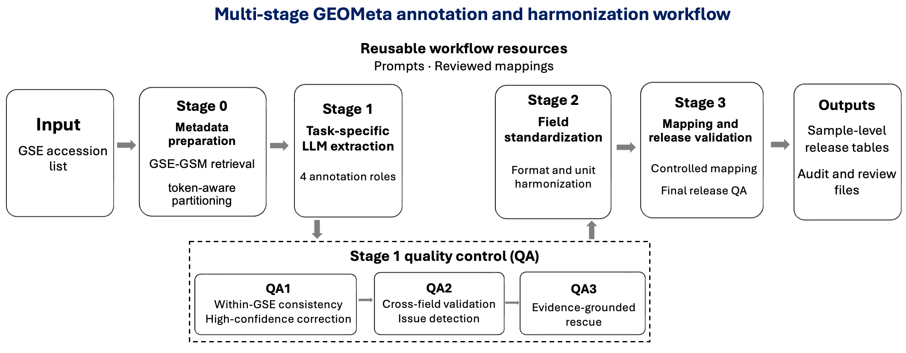

# GEOMeta


GEOMeta is an LLM-guided framework for sample-level metadata extraction, semantic standardization, controlled inference, biomedical mapping, and quality-controlled release generation for GEO transcriptomic studies.

---

# Overview

GEO metadata are highly heterogeneous across studies due to inconsistent free-text annotations, incomplete sample descriptions, variable disease terminology, fragmented tissue naming conventions, and inconsistent experimental metadata reporting.

GEOMeta addresses these challenges through a fixed multi-stage workflow that combines:

- Context-aware sample-level metadata extraction
- Field-specific semantic standardization
- Controlled metadata inference
- Disease, tissue, RNA-source, and perturbation mapping
- Deterministic and evidence-grounded quality control
- Review-aware recovery and release generation

The current curated GEOMeta release comprises **594,989 GSM samples from 22,782 unique GSE studies**, spanning diverse disease, tissue, demographic, and perturbation contexts.

---

# Pipeline Overview

<p align="center">
  
</p>

---

# Installation

## 1. Clone Repository

First, move to the local folder where you want to download GEOMeta:

```bash
cd /path/to/your/workspace
```

Then clone the repository:

```bash
git clone https://github.com/Bin-Chen-Lab/GEOMeta.git
cd GEOMeta
```

The git clone command creates a local folder named GEOMeta in the selected workspace. The cd GEOMeta command enters the GEOMeta project folder.

---

## 2. Create a clean conda environment

GEOMeta has been tested with Python 3.11 and 3.12. A clean conda-forge environment is recommended.

If your shell inherits library paths from another Anaconda installation, unset them first:

```bash
unset DYLD_LIBRARY_PATH
unset DYLD_FALLBACK_LIBRARY_PATH
unset LD_LIBRARY_PATH
```

Create and activate the environment:

```bash
conda create -n geometa -c conda-forge --override-channels \
  python=3.11 \
  numpy \
  pandas \
  openpyxl \
  scikit-learn \
  requests \
  fastparquet \
  python-docx \
  rapidfuzz \
  openai \
  expat \
  libexpat \
  -y

conda activate geometa
```

Optional dependency check:

```bash
python - <<'PY'
import pandas, sklearn, fastparquet, openai, openpyxl, docx, rapidfuzz
print("GEOMeta dependencies imported successfully.")
PY
```

## 3. Configure the LLM backend

GEOMeta uses an **OpenAI-compatible Chat Completions interface**. The backend is controlled by four environment variables:

| Variable | Description |
|---|---|
| `LLM_API_TYPE` | Use `openai_compatible` for the backends below. |
| `LLM_BASE_URL` | Base URL of the selected endpoint. |
| `LLM_API_KEY` | API key or local-server placeholder key. |
| `LLM_MODEL` | Exact model identifier exposed by the provider or server. |

### Direct OpenAI API

The current GEOMeta configuration defaults to the direct OpenAI endpoint and `gpt-5`.

```bash
export LLM_API_TYPE="openai_compatible"
export LLM_BASE_URL="https://api.openai.com/v1"
export LLM_API_KEY="your_openai_api_key"
export LLM_MODEL="gpt-5"
```

Users may replace `gpt-5` with another OpenAI model that supports Chat Completions. Model availability and model names can change over time.

For direct OpenAI use, `OPENAI_API_KEY` and `OPENAI_MODEL` are also accepted as aliases, although the generic `LLM_*` variables are recommended for easier provider switching.

### OpenRouter

```bash
export LLM_API_TYPE="openai_compatible"
export LLM_BASE_URL="https://openrouter.ai/api/v1"
export LLM_API_KEY="your_openrouter_key"
export LLM_MODEL="deepseek/deepseek-v4-flash-0731"
```

The model above is an example configuration used during GEOMeta testing. Replace it with another model identifier available through your OpenRouter account if desired.

<details>
<summary><strong>Other OpenAI-compatible backends</strong></summary>

### LiteLLM proxy

For a local LiteLLM proxy running on its default port:

```bash
export LLM_API_TYPE="openai_compatible"
export LLM_BASE_URL="http://localhost:4000"
export LLM_API_KEY="your_litellm_key"
export LLM_MODEL="<MODEL-NAME-CONFIGURED-IN-LITELLM>"
```

### Local vLLM server

```bash
export LLM_API_TYPE="openai_compatible"
export LLM_BASE_URL="http://localhost:8000/v1"
export LLM_API_KEY="your_vllm_api_key"
export LLM_MODEL="<VLLM-MODEL-NAME>"
```

If the server was started without authentication, GEOMeta still requires a non-empty `LLM_API_KEY`; a placeholder value can be used.

### Local Ollama server

```bash
export LLM_API_TYPE="openai_compatible"
export LLM_BASE_URL="http://localhost:11434/v1"
export LLM_API_KEY="ollama"
export LLM_MODEL="<OLLAMA-MODEL-NAME>"
```

For local Ollama, the API-key value is required by the client but is normally ignored by the server.

### Local LM Studio server

```bash
export LLM_API_TYPE="openai_compatible"
export LLM_BASE_URL="http://localhost:1234/v1"
export LLM_API_KEY="lm-studio"
export LLM_MODEL="<LM-STUDIO-MODEL-ID>"
```

Use the model identifier shown for the model loaded in LM Studio.

</details>

### Verify the active LLM configuration

From the GEOMeta repository root:

```bash
python - <<'PY'
from pathlib import Path
from geo_annotation_agent.config import default_config

cfg = default_config(Path("."))
cfg.validate_env()

print("LLM_API_TYPE:", cfg.llm_api_type)
print("LLM_BASE_URL:", cfg.llm_base_url)
print("LLM_MODEL:", cfg.llm_model)
print("LLM configuration detected successfully.")
PY
```

This verifies that GEOMeta can read the selected backend configuration without printing the API key.

Model choice can affect annotation quality, runtime, API cost, and supported context length. For local or smaller-context models, make sure the model context window is compatible with the token-budget settings in `geo_annotation_agent/config.py` before running very large GSEs.

> Do not store API keys directly in the codebase or commit them to GitHub.

---
# Running GEOMeta

## 1. Prepare the GSE input

The repository includes an example input file:

```text
input/gse_ids.csv
```

The file should contain a column named `GSE_ID`:

```text
GSE_ID
GSE130063
GSE53779
```

Replace the example accessions with your own GSE list. Supported input formats also include Excel, TSV, and TXT.

## 2. Run the full pipeline

For routine annotation runs:

```bash
PYTHONPATH=. python -u scripts/run_pipeline.py \
  --workdir . \
  --gse-file input/gse_ids.csv \
  --run-version geometa_run \
  --stage1-qa3-mode smart
```

Main arguments:

- `--workdir .` uses the current repository root as the working directory.
- `--gse-file` specifies the GSE input file.
- `--run-version` defines the prefix used for generated outputs.
- `--stage1-qa3-mode smart` enables prioritized, targeted QA3 review.

### QA3 modes

- `smart` — Recommended for routine use. Performs targeted evidence-grounded review of selected fields and samples requiring additional validation.
- `full` — Runs the broader QA3 workflow for comprehensive auditing or benchmarking.
- `off` — Disables QA3 review.

Eligible high-confidence QA3 corrections can be applied according to the configured release policy, while unresolved or ambiguous cases are retained for review.

## 3. Run a single GSE

```bash
PYTHONPATH=. python -u scripts/run_pipeline.py \
  --workdir . \
  --gse GSE130063 \
  --run-version geometa_GSE130063 \
  --stage1-qa3-mode smart
```

---

# Pipeline Stages

## Stage 0 — GEO Retrieval and Preparation

Retrieves GSE- and GSM-level metadata directly from NCBI GEO and constructs annotation-ready metadata blocks.

Key features include local caching, retry/recovery, metadata- and token-aware chunking, and structured GSE/GSM metadata preparation.

Implemented in:

```text
geo_annotation_agent/stage0_retrieve.py
```

## Stage 1 — Sample-Level Metadata Annotation

Performs structured GSM-level metadata extraction through four task-specific annotation agent calls covering experimental context, biological context, perturbation, and sample metadata.

Each call combines GEO study/sample context, task-specific instructions, restricted target fields, and a structured output contract. The outputs are merged into the canonical 27-field GEOMeta sample-level schema.

Stage 1 is followed by deterministic within-GSE consistency checks, cross-field validation, and optional evidence-grounded QA3 review.

Implemented in:

```text
geo_annotation_agent/stage1_annotate.py
```

Prompts:

```text
Annotation_Prompts/
```

## Stage 2 — Field-Specific Standardization and Controlled Inference

Stage 2 applies **21 field-specific standardization agent tasks**. Each combines a reusable prompt template, candidate terms from one metadata field, field-restricted instructions, and a structured output contract.

Three controlled-inference tasks are also performed:

- Age group from standardized age
- Sex from clearly sex-specific tissue context when sex is otherwise unavailable
- Perturbation type from the standardized perturbation term

If a field contains no eligible non-missing terms, GEOMeta preserves the input value without making an unnecessary LLM call.

Implemented in:

```text
geo_annotation_agent/stage2_postprocess.py
```

Prompts:

```text
postprocessing/
inference/
```

## Stage 3 — Biomedical Mapping and Release Validation

Stage 3 links standardized metadata to curated biomedical vocabularies and external reference resources through reviewed mapping reuse, task-specific LLM-assisted mapping or semantic matching where applicable, and deterministic reference lookup.

Major workflows include:

- **Disease:** CTD/MEDIC mapping and disease hierarchy information
- **Tissue:** curated GEOMeta tissue vocabulary
- **RNA source:** reviewed mappings and cell-line reference matching
- **Chemical perturbations:** reviewed mapping reuse and PubChem lookup with title/synonym verification
- **Release validation:** deterministic checks of mapped fields, category consistency, within-GSE/global consistency, and perturbation mapping integrity

Implemented in:

```text
geo_annotation_agent/stage3_map.py
geo_annotation_agent/stage4_validate_release.py
```

Mapping resources:

```text
mappings/
```

---

# Output Files

Runtime files are generated under:

```text
artifacts/
```

Main subdirectories:

```text
artifacts/
├── outputs/
├── ledgers/
├── mapping_cache/
├── review_queue/
├── manual_review/
├── geo_cache/
└── runs/
```

Representative outputs:

| File | Description |
|---|---|
| `*_stage0_input.parquet` | Full-fidelity GEO retrieval output |
| `*_stage1_raw.xlsx` | Raw Stage 1 sample-level annotations |
| `*_stage1_final_for_stage2.xlsx` | Stage 1 output after QA |
| `*_stage2_post_final.xlsx` | Final Stage 2 standardized annotations |
| `*_stage3_mapped.xlsx` | Full mapped dataset |
| `*_stage3_mapped_filtered.xlsx` | Filtered mapped dataset |
| `*_stage3_final_release.xlsx` | Simplified final release dataset |
| `*_stage3_cp_perturbation_release.xlsx` | Chemical perturbation-focused release |
| `*_stage4_release_mapping_qa.xlsx` | Deterministic release-level mapping QA report |

The pipeline also generates review queues, ledgers, caches, novel-term reports, and a run-level output index.

---

# Running Individual Stages

The full pipeline is recommended for most users. Downstream stages can also be rerun from saved outputs.

## Stage 2

```bash
PYTHONPATH=. python scripts/run_stage2.py \
  --workdir . \
  --stage1 artifacts/outputs/<run_version>_stage1_raw.xlsx \
  --run-version <run_version>
```

## Stage 3

```bash
PYTHONPATH=. python scripts/run_stage3.py \
  --workdir . \
  --stage2 artifacts/outputs/<run_version>_stage2_post_final.xlsx \
  --run-version <run_version>
```

Replace `<run_version>` with the identifier used for the corresponding run.

---

# Repository Structure

```text
scripts/                Pipeline execution scripts
geo_annotation_agent/   Core pipeline implementation
Annotation_Prompts/     Stage 1 annotation prompts
postprocessing/         Stage 2 standardization prompts
inference/              Controlled-inference prompts
mappings/               Mapping resources and reviewed reference files
input/                  Input GSE accession lists
figures/                Workflow figures and diagrams
artifacts/              Runtime outputs, caches, ledgers, and review files
```

---

# Current Mapping and Reference Resources

- **Disease:** CTD/MEDIC and MeSH-compatible disease hierarchy information
- **Tissue:** curated GEOMeta tissue vocabulary and brain-region normalization
- **Chemical perturbations:** reviewed mappings and PubChem
- **RNA source/cell lines:** reviewed RNA-source mappings and cell-line reference metadata

---

# Caching and Reproducibility

GEOMeta maintains persistent runtime caches for GEO retrieval, field-specific standardization, controlled inference, and biomedical mapping.

Intermediate outputs, ledgers, caches, and review artifacts support restart, auditing, and iterative refinement. If prompt rules or mapping resources are intentionally changed, clear the corresponding runtime cache before evaluating the updated configuration.

---

# Troubleshooting

### `No module named expat` or XML-library errors

If library paths point to another Anaconda/Python installation:

```bash
unset DYLD_LIBRARY_PATH
unset DYLD_FALLBACK_LIBRARY_PATH
unset LD_LIBRARY_PATH
```

Then recreate the GEOMeta conda environment.

### `ModuleNotFoundError`

Confirm that the environment is active:

```bash
conda activate geometa
```

Install the missing package from conda-forge if needed.

### Parquet engine error

```bash
conda install -c conda-forge fastparquet -y
```

### Shell shows `>` after a multi-line command

The final line of a multi-line shell command should not end with `\`.

### `cd: too many arguments`

Wrap paths containing spaces in quotation marks:

```bash
cd "/path/containing spaces/GEOMeta"
```

### `GSE input file not found`

```bash
ls -lh input/gse_ids.csv
```

---

# Notes

- GEO metadata completeness and quality vary substantially across studies.
- Source metadata may contain ambiguous, missing, or inconsistent descriptions that cannot always be resolved automatically.
- LLM outputs are constrained through task-specific instructions, structured output contracts, deterministic checks, and review-aware workflows.
- Large-scale processing may require substantial LLM API quota depending on dataset size, metadata complexity, selected model, and QA configuration.

---

# Acknowledgments

GEOMeta makes use of data and reference resources from:

- NCBI Gene Expression Omnibus (GEO)
- Comparative Toxicogenomics Database (CTD/MEDIC)
- PubChem

# Citation

If you use GEOMeta in your work, please cite:

> Zhang X, Paithankar S, Pu J, Murtaza MS, Shankar R, Leshchiner D, Koirala S, Palmer Z, Nault R, Li X, Xie Y, Chen B. Automating scientific annotations for open transcriptomic profiles via multi-stage agents. bioRxiv (2026). https://doi.org/10.64898/2026.08.19.745739
- Human Protein Atlas
- Cancer Dependency Map (DepMap), Broad Institute
